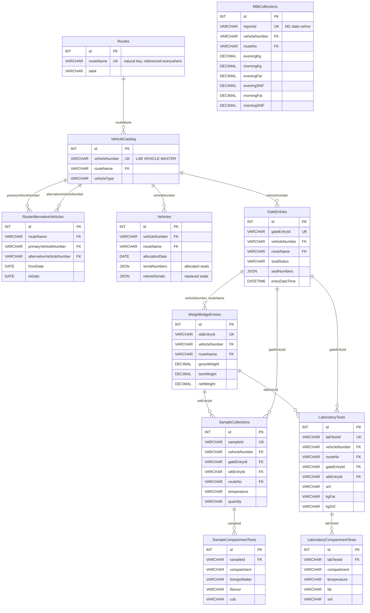

# CHIMUL MILK PLANT - ER DIAGRAM (Graphical Representation)

> This Mermaid diagram renders graphically in GitHub, GitLab, VS Code (with Mermaid
> extension), Typora, and most Markdown viewers. It shows every table across the
> 4 stages and the **Primary Key (PK) <-> Foreign Key (FK)** relationships.

---

## Flow Legend
| Stage | Module | Source of truth / common key |
|------|--------|------------------------------|
| 1 | Lab Vehicle Master → Route Alternative → Vehicles | `vehicleNumber` + `routeName` |
| 2 | Gate Entry | Uses Stage 1: `vehicleNumber` + `routeName` |
| 3 | Weighment (WeighBridge) | Uses Gate: `vehicleNumber` + `routeName` |
| 4 | Sample Collection / Truck Sheet / Lab Calculation | Uses Weighment + Master + Gate: `wbEntryId` / `gateEntryId` / `vehicleNumber` |

## Key Facts
- **`Routes.routeName`** = the shared route key across all 8 modules.
- **`VehicleCatalog.vehicleNumber`** = the master vehicle key (lab vehicle master data).
- **`GateEntries.gateEntryId`** & **`WeighBridgeEntries.wbEntryId`** = business keys that
  stitch the transactional chain: Gate → Weighment → Sample / Truck / Lab.
- Alternative vehicles (`RouteAlternativeVehicles`) are expanded into every search so both
  the primary and alternative plate resolve correctly in Gate, Weighment, Sample, Truck Sheet
  and Lab.
